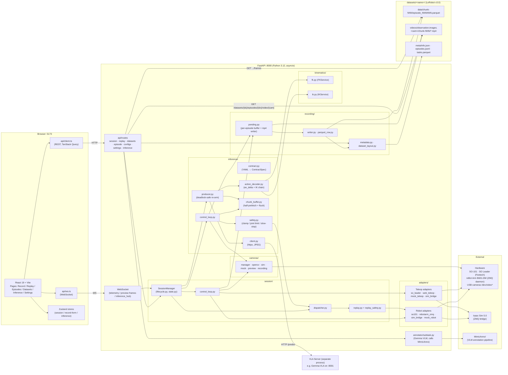

# MimicRec System Architecture

## Notes

- Frontend (`frontend/src/`) talks to FastAPI on `:8000` via REST + WebSocket.
- `SessionManager` is the hub. `control_loop` drives adapters + cameras + the recording buffer; `dispatcher` / `replay` handles playback.
- Adapters split into robot (so101 / rebotarm_zmq / sim_bridge / mock) and teleop (so_leader / web_teleop / sim_bridge / mock).
- Recording: `pending` buffers per episode, then `writer` + `parquet_row` emit parquet on commit; `metadata` / `dataset_layout` update meta files.
- Storage follows LeRobot v3: `data/`, `videos/{video_key}/chunk-NNN/`, `meta/`.
- Subtask annotation lives in the `MimicAnno/` sub-project.

### Inference mode (`SessionMode.INFERENCE`)

`SessionManager` also supports a third mode where the action source is an external Vision-Language-Action (VLA) HTTP server instead of a teleoperator. `inference/producer.py` runs as an async task: it snapshots cameras + robot state + instruction, calls the VLA server, decodes the response into joint targets via FK/IK, and pushes them to `chunk_buffer`. `inference/control_loop.py` consumes one step per tick, runs it through `inference/safety.py` (per-step delta clamp + joint limit + slow-stop on chunk-late + gripper hold), and writes to the same `command_goal_slot` as teleop. `RECORDING` phase reuses the existing parquet/mp4 writer — rollouts are normal LeRobot v3 episodes with three additional metadata columns (`source`, `inference_config`, `stop_reason`). Telemetry events stream to a new `inference_hub` WebSocket. Contracts are YAML files at `configs/inference/<name>.yaml`, validated by `inference/contract.py` (pydantic v2). See spec `docs/superpowers/specs/2026-05-05-vla-inference-interface-design.md` for the full design.
