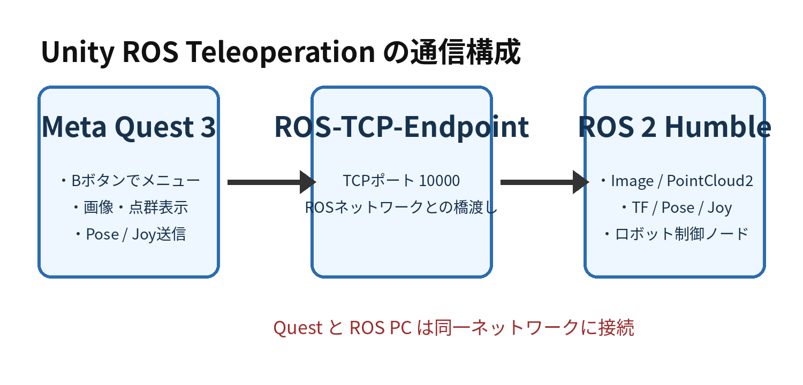
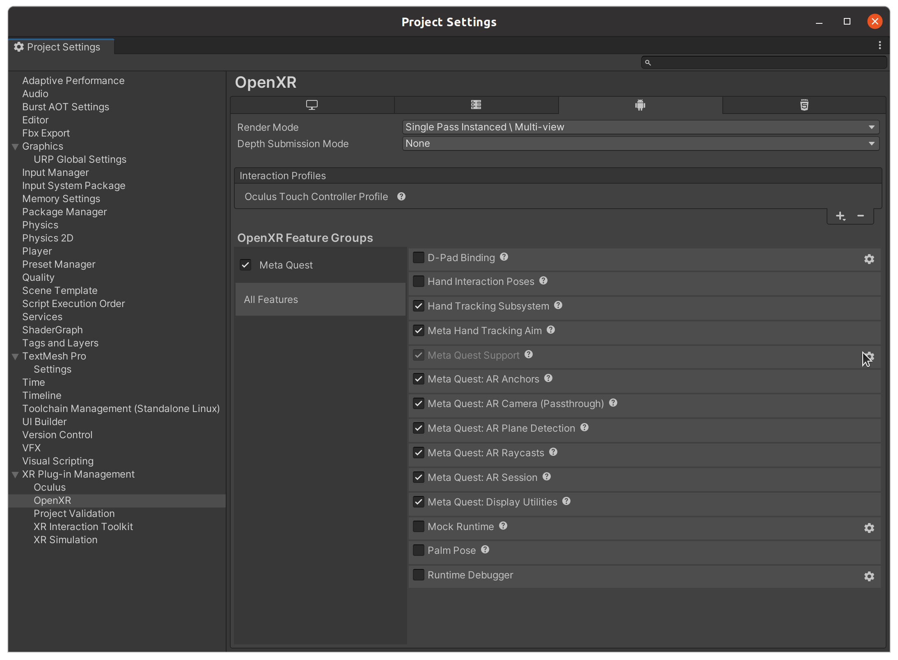
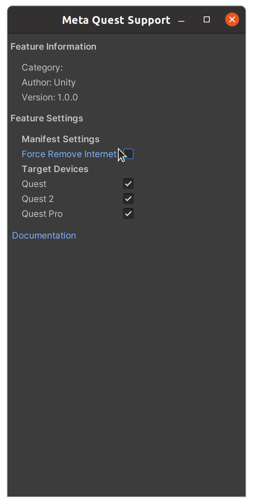
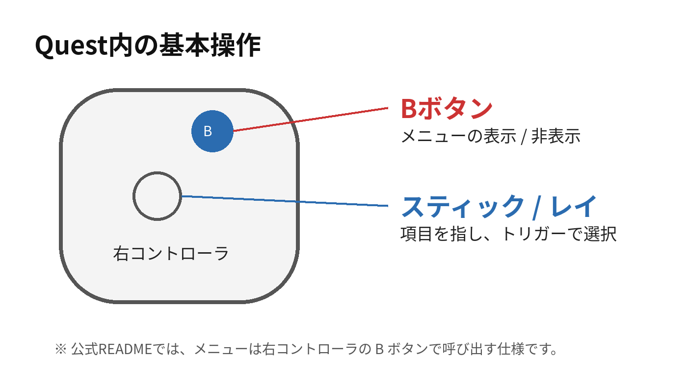
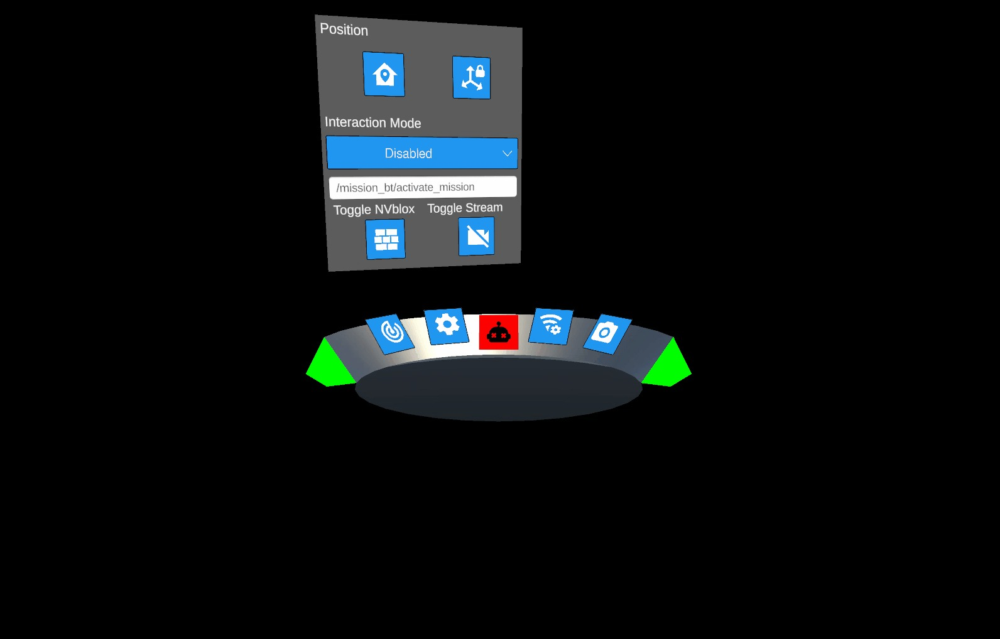
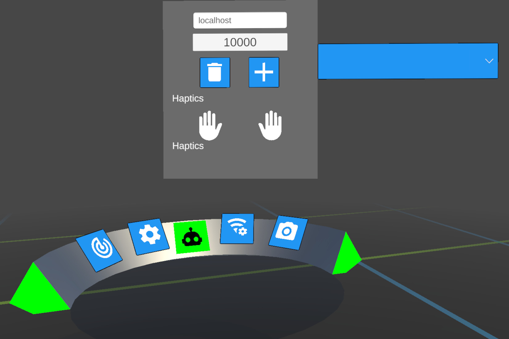
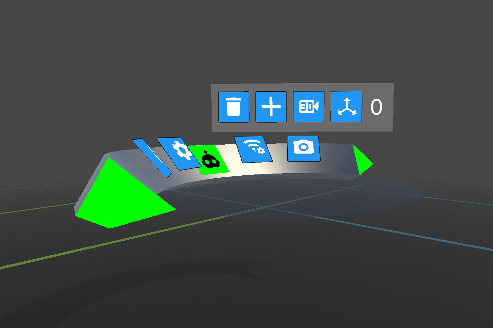
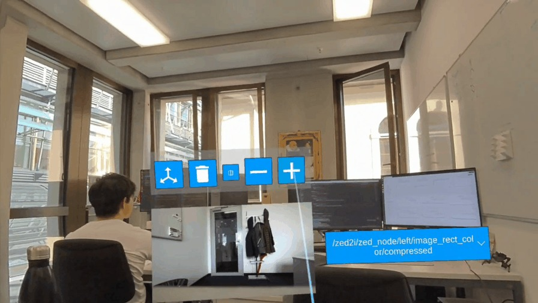

# Unity ROS Teleoperation

## Meta Quest 3 操作・導入ガイド

Ubuntu 22.04 / ROS 2 Humble / Unity 6000.2.15f1



対象リポジトリ: leggedrobotics/unity_ros_teleoperation

*確認日: 2026-07-19　対象バージョン: v0.2.0*

# 1. この資料の目的

この資料は、Unity ROS TeleoperationをMeta Quest 3で起動し、Quest内のメニューからROS 2へ接続して、カメラ映像・点群・ロボット情報を表示するまでを説明する。特に、ヘッドセットを装着した後の操作を重点的に扱う。

| **対象機器** | Meta Quest 3                                 |
|--------------|----------------------------------------------|
| **PC環境**   | Ubuntu 22.04 LTS / ROS 2 Humble              |
| **Unity**    | Unity 6000.2.15f1（リポジトリ指定）          |
| **通信**     | Quest → Wi-Fi/TCP → ROS-TCP-Endpoint → ROS 2 |

注意: Unity側リポジトリは汎用XR/ROS基盤である。MimicRecでは、Questから送信されたPose/Joyを安全なEEF速度へ変換し、カメラをQuestへ返す`mimicrec_quest_bridge`を`integrations/ros2/`に実装している。導入と起動は[連携README](README.md)を参照する。

# 2. 全体の起動順序

1. ROS 2 PCでROS-TCP-Endpointを起動する。
2. Quest 3とROS 2 PCを同じWi-Fi/LANへ接続する。
3. Quest 3でUnity ROS Teleoperationアプリを起動する。
4. 右コントローラのBボタンでメニューを表示する。
5. 接続設定にROS-TCP-Endpointを動かしているPCのIPアドレスとポートを入力する。
6. 接続後、メニューの縁とロボットアイコンが緑色になることを確認する。
7. Images、PointCloudsなどのメニューでROSトピックを選択する。

# 3. Meta Quest 3を開発用端末にする

## 3.1 開発者モード

QuestへUnityアプリを直接インストールするには、Meta Developer Dashboardで組織を作成し、Questの開発者モードを有効化する。ここでいう「組織」は会社への所属ではなく、Meta開発者アカウント上で作る開発単位である。個人開発でも任意の組織名を作成できる。

開発者モード有効化後は、QuestをUSB接続した際にヘッドセット内へUSBデバッグ許可画面が表示される。使用するPCを固定する場合は「このコンピューターから常に許可」にチェックして許可する。

## 3.2 Quest側で確認する項目

- 開発者モードが有効
- QuestとPCが同じネットワーク
- USBデバッグを許可済み
- コントローラが接続済み
- アプリ起動時の空間・パススルー権限を許可

# 4. UnityからQuestへビルドする

Unityで File → Build Profiles（旧Build Settings）を開き、Androidへ切り替える。QuestがUSB接続され、実行先デバイスとして認識されている状態で Build And Run を実行する。



*図1　Project Settings → XR Plug-in Management → OpenXR。Meta Quest関連機能が有効な状態。*

## 4.1 重要: INTERNET権限を消させない

ROS-TCP通信にはAndroidアプリのINTERNET権限が必要である。公式ドキュメントでは、Meta Quest Supportの設定にある「Force Remove Internet」をビルド前に無効化するよう指定されている。



*図2　Meta Quest Support設定。「Force Remove Internet」のチェックを外す。*

AndroidManifest.xmlには次の権限が必要:

```xml
<uses-permission android:name="android.permission.INTERNET" />
```

# 5. Quest内での基本操作



## 5.1 アプリの起動

APKをBuild And Runした直後は自動起動する。後から起動する場合は、Questのアプリライブラリを開き、開発用または提供元不明アプリの一覧から対象アプリを選択する。Quest OSのバージョンにより一覧名や場所は変わる。

## 5.2 メニューの表示

公式のMenuコンポーネント説明では、右コントローラのBボタンでフローティングメニューを表示する。もう一度押すと非表示になる。メニューには4つのサブメニューとROS接続状態が表示される。



*図3　Quest内のフローティングメニュー（公式GIFの一場面）。*

## 5.3 アイコンの意味

| **アイコンの目安** | **役割**           | **操作内容**                            |
|--------------------|--------------------|-----------------------------------------|
| 電源               | 表示・機能の有効化 | 選択中の機能をON/OFF                    |
| 歯車               | 一般設定           | 表示設定、パススルー等                  |
| ロボット           | 状態・デバッグ     | 緑でROS接続成功。押すとVR Debug Console |
| Wi-Fi＋歯車        | 接続設定           | IP、ポート、ROS接続先の追加・選択       |
| カメラ             | 画像設定           | ROS Imageトピックの表示管理             |

# 6. ROS 2への接続操作

## 6.1 ROS 2 PC側

MimicRecの起動スクリプトは、ROS-TCP-EndpointとQuestブリッジを同じlaunchで起動する。既定ではTCPポート10000を使う。

```bash
hostname -I
```

```bash
cd /path/to/MimicRec
bash scripts/run_quest_ros2.sh
```

```bash
ss -lntp | grep 10000
```

Questに入力するIPは、上記hostname -Iで確認したROS PCのLAN側IP（例: 192.168.1.50）。localhostや127.0.0.1はQuest自身を指すため使用しない。

## 6.2 Quest側



*図4　Connection Settings。上段にIP、下段にポートを入力し、接続先を追加・選択する。*

1.  右コントローラBボタンでメニューを開く。
2.  Wi-Fi＋歯車アイコンを選ぶ。
3.  IP欄へROS-TCP-Endpoint PCのIPアドレスを入力する。
4.  ポート欄へ10000（Endpoint設定に合わせる）を入力する。
5.  ＋ボタンで接続先を追加し、右側のドロップダウンから選択する。
6.  接続成功時、メニューの縁とロボットアイコンが緑色になる。

# 7. ROSカメラ画像をQuest内に表示する



*図5　Imagesメニュー。＋で表示を追加し、ゴミ箱で削除する。3Dカメラ等のボタンで表示方式を切り替える。*

基本手順:

1. ROS 2側で画像トピックが配信されていることを確認する。
2. Questでカメラアイコンを開く。
3. ＋ボタンでImage Viewerを追加する。
4. トピック選択欄から対象のsensor_msgs/Imageトピックを選ぶ。
5. 生成されたフローティング画面を見やすい位置へ移動する。
6. 不要になった画面はゴミ箱アイコンで削除する。



*図6　Camera Viewerの表示例（公式GIFの一場面）。*

## 7.1 ROS 2側の確認コマンド

```bash
ros2 topic list | grep -E 'image|camera'
```

```bash
ros2 topic info /camera/color/image_raw
```

```bash
ros2 topic hz /camera/color/image_raw
```

トピックが一覧に出ない場合は、Quest側では選択できない。画像形式、帯域、ROS-TCP-Endpointへの登録状況も確認する。高解像度・高FPS画像はWi-Fi帯域とQuest描画負荷が大きいため、最初は640×480・15〜30 Hz程度で確認する。

# 8. PointCloud・LiDAR・TF表示

PointCloudsメニューにはRGBD用とLiDAR用の表示が既定で用意されている。トピック欄を選択するとPointCloud2トピックの候補が表示される。円形ボタンはLiDAR表示、3DカメラアイコンはRGBD表示の切り替えに使われる。ゴミ箱で両方を消去できる。

TF可視化は、ROSから受信したフレーム関係が正しいかをQuest空間内で確認する用途に使える。表示位置が大きくずれる場合は、Unity-ROS座標変換、root frame、map/odom/base_linkの関係を確認する。

# 9. ヘッドセット・コントローラ入力をROSへ送る

リポジトリにはHeadset Publisher、Hands、PosePublisherがあり、ヘッドセット・手・コントローラのPose、TF、Joystick指令をROS側へ送信できる。実際のトピック名はUnityシーン内の各コンポーネント設定に依存するため、起動後にROS側で一覧を確認する。

```bash
ros2 topic list
```

```bash
ros2 topic echo <Questから送られるPoseトピック>
```

```bash
ros2 topic echo <Joyトピック>
```

## 9.1 MimicRecからロボットアームへつなぐ場合

`mimicrec_quest_bridge`は、右グリップを押した時点のコントローラ姿勢を基準として、その後の相対移動だけをEEF速度へ反映する。Quest Poseを直接モータ指令にはしない。

- 操作開始時にQuestコントローラPoseとロボットEEF Poseを保存
- Questの相対並進・相対回転を計算
- Unity座標系からROS座標系へ変換
- 倍率、速度上限、可動域を適用
- MimicRecの`DeltaEEToReBotArmMapper`でIK、可動域、関節ステップを検証
- 通信断、入力タイムアウト、ボタン解放時は即停止

# 10. Quest側トラブルシューティング

| **症状**                     | **確認箇所**                                     | **対処**                                           |
|------------------------------|--------------------------------------------------|----------------------------------------------------|
| アプリがQuestに入らない      | 開発者モード、USBデバッグ、Android Build Support | adb devicesでQuestがdevice表示されるか確認         |
| アプリは起動するが接続しない | IP、ポート、INTERNET権限                         | Force Remove Internetを外して再ビルド              |
| 接続先にlocalhostを設定した  | 接続先IP                                         | ROS PCの192.168.x.x等へ変更                        |
| メニューが出ない             | 右コントローラ入力                               | Bボタン、OpenXR入力、コントローラ接続を確認        |
| メニューが緑にならない       | Endpoint、FW、Wi-Fi                              | PCで10000番待受、Questと同一LANを確認              |
| 画像トピックが選べない       | ROSトピック配信                                  | ros2 topic list/infoで型と存在を確認               |
| 画像が黒い・止まる           | 帯域、解像度、FPS                                | 低解像度・低FPSから試す                            |
| 点群の位置がずれる           | TF、root frame                                   | map/odom/base_linkとUnity原点を確認                |
| パススルーが出ない           | 権限、OpenXR Meta Quest機能                      | AR Camera(Passthrough)と実行時権限を確認           |
| 赤いログが視界を覆う         | VR Debug Console                                 | ロボットアイコンでDebug表示を閉じ、Unityログを修正 |

# 11. 最短チェックリスト

- [ ] Quest開発者モード ON
- [ ] Unity 6000.2.15f1でプロジェクトを開く
- [ ] AndroidへSwitch Platform
- [ ] Meta Quest Support → Force Remove Internet OFF
- [ ] QuestへBuild And Run
- [ ] ROS 2 PCでROS-TCP-Endpointを起動
- [ ] QuestとPCを同じネットワークへ接続
- [ ] Bボタンでメニュー表示
- [ ] ROS PCのIPとポート10000を設定
- [ ] メニューが緑になる
- [ ] Image / PointCloud / Poseトピックを選択

# 12. 参考情報

- leggedrobotics/unity_ros_teleoperation README（v0.2.0、Unity 6000.2.15f1、Quest 3、各コンポーネント一覧）
- docs/quest.md（開発者モード、Androidビルド、INTERNET権限、Force Remove Internet）
- Assets/Components/Menu/README.md（Bボタン、接続状態の緑表示、各メニュー）
- ROS-TCP-Endpoint（ROS 2ではmain-ros2ブランチ）

公式URL: <https://github.com/leggedrobotics/unity_ros_teleoperation>
